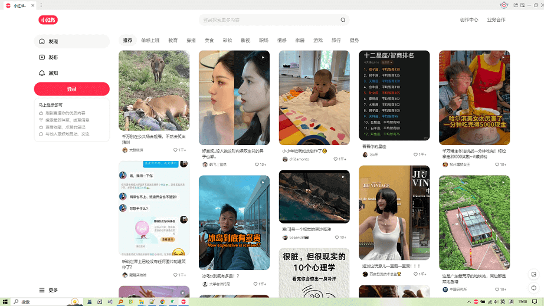

 

    
    
    

## 📣 简介
小红书助手，一款极致阅读体验、桌面小窗摸鱼、多账号登录、视频笔记下载的助手软件，时尚生活用户专属。支持桌面窗口置顶显示、小窗办公摸鱼模式、多账号同时登录、活跃账号、自动互动评论、AI自动发布笔记等功能，可让用户在小红书笔记阅读上，获得更开阔的视觉享受体验和智能交互。

    

## 🌟 特性
- 全屏开阔阅读
专注于小红书笔记阅读，自适应各种屏幕大小，以获得更加友好的阅读体验。

    

- 小窗摸鱼模式
支持固定在桌面上，进行小窗模式浏览阅读。

    

- 多账号活跃、视频笔记下载、AI自动评论等运营功能
可多个账号同时登录，提升账号活跃度。还支持视频下载、自动评论等运营辅助功能，提升您的办公效率。

    

## ⚡ 快速开始

- 安装版
前往 [小红书助手官网](http://xhs.cpanx.com) 下载最新的安装包，然后双击安装使用即可。

- 绿色版
前往 [小红书助手绿色软件包下载地址](https://github.com/ChenXi996/xiaohongshu/releases) 下载最新的绿色压缩包，然后解压，再双击启动主程序 ***XHSAssistant.exe*** 文件即可使用。

## 📖 用户反馈、技术交流、商务合作

- 相关商务合作、产品问题反馈、技术交流等需求，可进入 [极智人生用户反馈QQ群](https://qm.qq.com/q/CkEX6hUMMg) 进行交流咨询。
- 或者发送邮件到邮箱进行沟通：lifetech996@163.com 。

## 👀 效果展示

    

## 🚀 官网
更多详情可移步
[小红书助手官网](http://xhs.cpanx.com)
进行了解。
